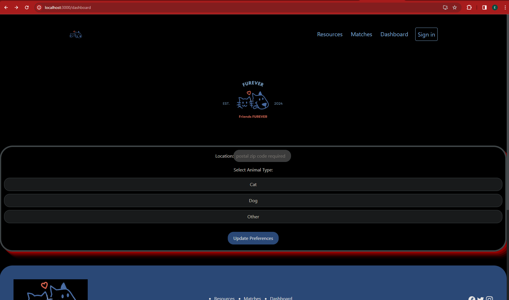
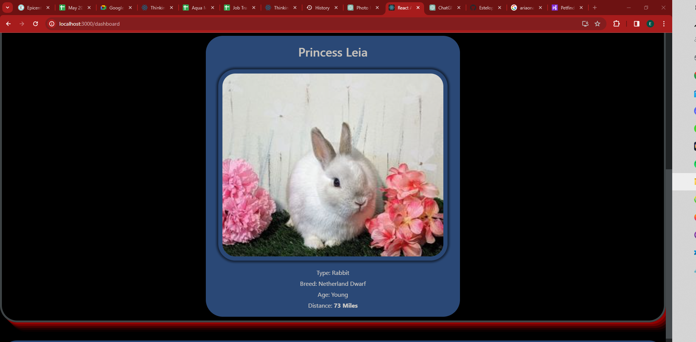
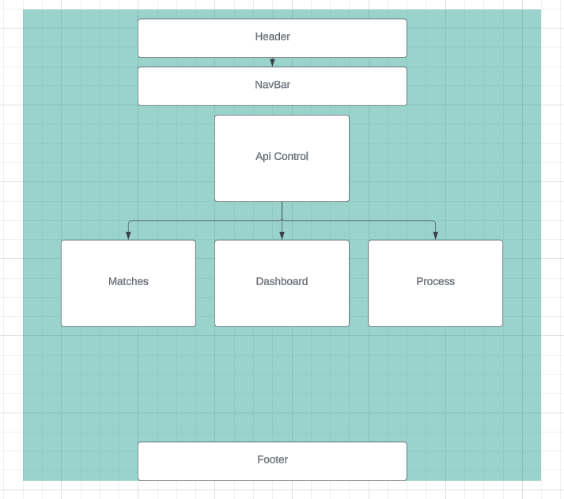

# Furever

## Description
This app will aim to streamline the connection between shelters with animals up for adoption and potential pet owners.It will introduce users to their dream pets and facilitate their connection to new homes with a friendly and familiar ui. Bootstrapped with npm-create-react-app.

## Technologies Used

* Node Package Manager 
* webpack
* Jest
* ESlint
* dotenv
* Markdown
* Github
* JavaScript, HTML/CSS
* React
* React Router library
* Bootstrap
* PetFinder API





## Setup
1. Clone the project from github.
2. Navigate to project assembly directory in the terminal:  `cd furever` 
3. Install the project dependencies as needed: `npm install`
4. Within the production directory create a new file called `EnvironmentVariables.cs`. or `.env`
5.  Within the .env file put in the following code, replacing the `[REACT-API-KEY]` with your own API key. 


```.env file:

REACT_APP_API_KEY = [react-api-key]

REACT_APP_API_SECRET = [react-api-secret]

```
6. If you do not have a key and secret you can obtain one at https://www.petfinder.com/developers/ by signing in.
7. In the production directory furever run the dev server: `npm run start`


## Available Scripts

In the project directory, you can run:

### `npm start`
Runs the app in the development mode.\
Open [http://localhost:3000](http://localhost:3000) to view it in your browser.

### `npm test`

Launches the test runner in the interactive watch mode.\

### `npm run build`

Builds the app for production to the `build` folder.\
It correctly bundles React in production mode and optimizes the build for the best performance.

The build is minified and the filenames include the hashes.\
Your app is ready to be deployed!




### Research & Planning Log 
1/27/24
- query petfinder api-check
- add component tree?
1/30/24
- sr developer friend recommended Capacitorjs as native runtime environment - mobile friendly: possible mobile overlay for presentation or native app.
 1/31/24
 - starting in react w/hooks and adding branches for CapacitorJs, react native?
 -researched and read about mobile technologies for integrating app.  Capacitor seems to allow to keep everything unchanged after adding wiht light mods. React Native requires us to create all UI components from scratch, but we can keep redux/logic. 
 -ai chatbot implimentation branch further down road? 
 2/03/24 -2/04/24
 -practice with react components + first component tree + md
 2/07/24
 -animation and ui research. found solid sources for react ui components online 
 2/10/24
 - addtional animation research
 - ui boilerplate 
 2/12- 2/18
 -nailing down libraries and component structuring - spring library for swipe animation and component css inline styling- re render dom on every swipe? . Caching can reduce redundant API calls, and pagination can help manage large datasets more efficiently.
 - avoid bottom up approach focus on higher up components in hierarchy
 
## Known Bugs

* If it crashes clone the repository and start again
* email the host if there are re-occuring issues or any questions

## licensing info 
*Copyright (c) 3/10/24 Estevan Lopez
*MIT license 
